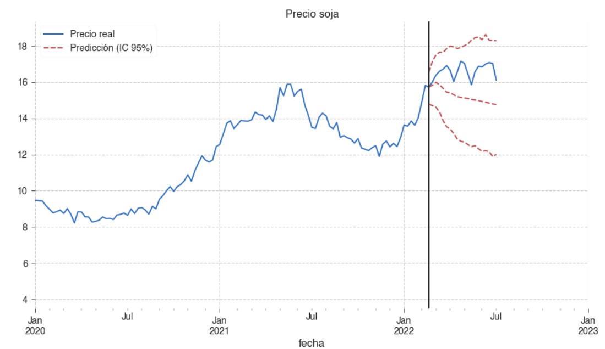
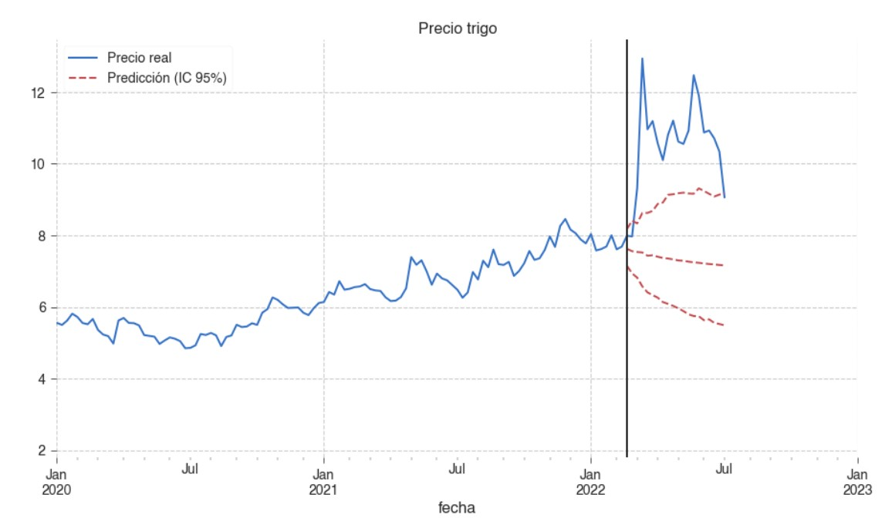
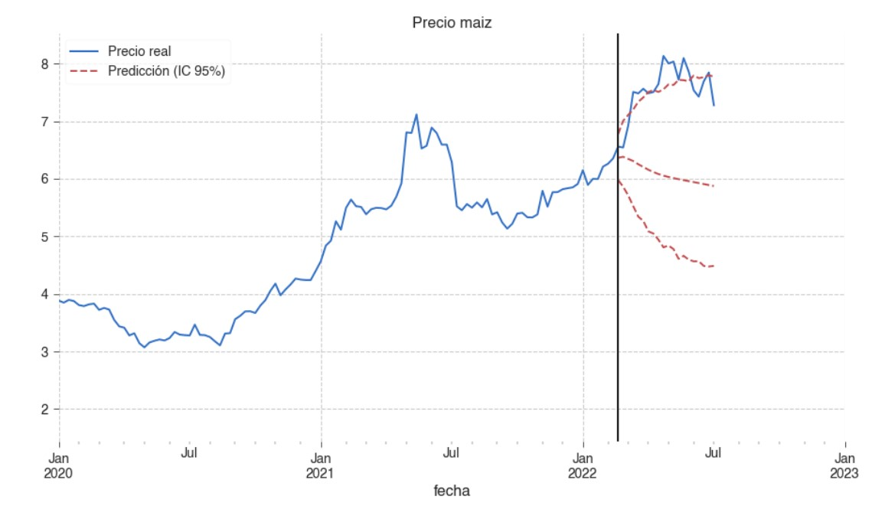

En este trabajo se testeó de manera estadística si la subida de precios en las commodities alimenticias al comienzo de la guerra entre Rusia y Ucrania fue debido a la guerra o si pudo haber sido una coincidencia. Para ello se creó un modelo de forecasting y se hizo un bootstraping para obtener intervalos de confianza del 95% del movimiento de los precios a partir del día de la guerra. Se concluyó que solamente en el caso de la soja, la subida de precio no fue debido a la guerra, mientras que la subida del trigo y del maíz sí lo fueron.

